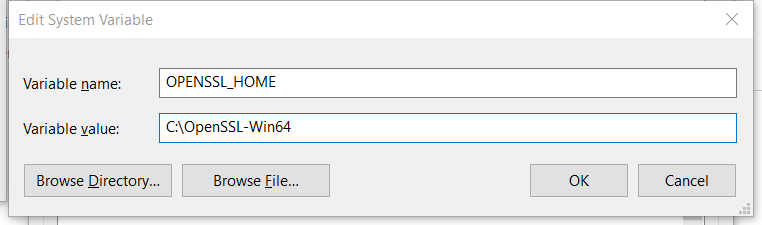
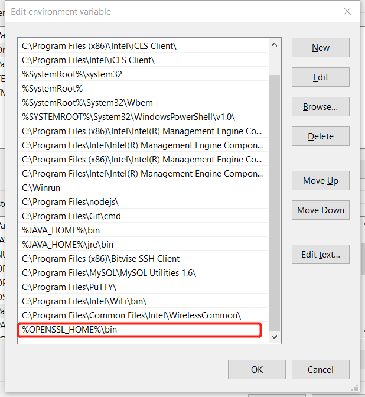
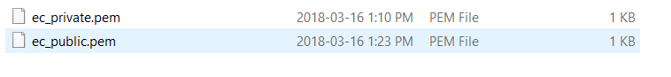

# OpenSSL  

### Download and Installation
  [Download OpenSSL for windows](http://slproweb.com/products/Win32OpenSSL.html)  
*Note. choose the correct version*

### Configure Environment Path

1. Set the **ssl** directory as OPENSSL_HOME


2. Add **ssl/bin** to PATH


### Open the terminal and change to project directory  
To generate key pairs using EC 
```
openssl ecparam -genkey -name prime256v1 -noout -out ec_private.pem
openssl ec -in ec_private.pem -pubout -out ec_public.pem
```


### Convert keys to PKCS8 for Java
In Java, you need to convert private keys to the PKCS8 format. To convert RS256 and ES256 keys from PEM format to PKCS8 format, run the following commands in your keys directory:  
```
openssl pkcs8 -topk8 -inform PEM -outform DER -in ec_private.pem -nocrypt > ec_private_pkcs8
```

# MQTT in JAVA
### MQTT library
[download it here](http://search.maven.org/#search%7Cga%7C1%7Ca%3A%22org.eclipse.paho.client.mqttv3%22) choose the jar file

### Include the library into project

### Download Server EMQ
EMQ is a massive, scalable, open-source server which supports MQTT protocols as well as HTTP.
It is also user-friendly.
Just choose the correct version, download it and extract it to the target directory.  
  
command ```emqttd start``` is used to start the service.  
command ```emqttd stop``` is used to stop the service.  
command ```emqttd_ctl status``` is used to check the status of EMQ

download [here](http://emqtt.com/)